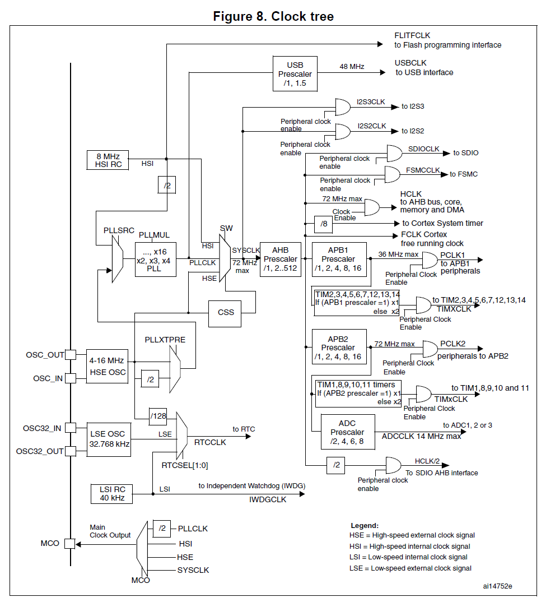

CAN Demo Init process based on STM32F10x

```c
/*----------------------------------------------------------------------------
  initialize CAN interface
 *----------------------------------------------------------------------------*/
void can_Init (void) {

  CAN_setup ();                                   // setup CAN interface
  CAN_wrFilter (33, STANDARD_FORMAT);             // Enable reception of messages

  /* COMMENT THE LINE BELOW TO ENABLE DEVICE TO PARTICIPATE IN CAN NETWORK   */
  CAN_testmode(CAN_BTR_SILM | CAN_BTR_LBKM);      // Loopback, Silent Mode (self-test)

  CAN_start ();                                   // leave init mode

  CAN_waitReady ();                               // wait til mbx is empty
}

```

then goto setup function

```c
/*----------------------------------------------------------------------------
  setup CAN interface
 *----------------------------------------------------------------------------*/
void CAN_setup (void)  {
  unsigned int brp = stm32_GetPCLK1();
    ...
}
```

```c
/*----------------------------------------------------------------------------
 STM32 get PCLK1
 deliver the PCLK1
 *----------------------------------------------------------------------------*/
unsigned int stm32_GetPCLK1 (void) {
  return ((unsigned int)__PCLK1);
}
```

```c
/*----------------------------------------------------------------------------
 Define  PCLK1
 *----------------------------------------------------------------------------*/
#define __PCLK1PRESC  ((__RCC_CFGR_VAL & CFGR_PRE1_MASK) >> 8) /* for the stm32f10x series */
#if (__PCLK1PRESC & 0x04)
  #define __PCLK1       (__HCLK >> ((__PCLK1PRESC & 0x03)+1))
#else
  #define __PCLK1       (__HCLK) /* if 1xx , not divided */
#endif

#define __RCC_CFGR_VAL             0x001D8402 /* hard coded number */
```

MCO2: Microcontroller clock output 2

MCO1: Microcontroller clock output 1

PPRE1: APB Low speed prescaler (APB1) Set and cleared by software to control APB low-speed clock division factor. not to exceed 45Mhz on this domain.

PPRE2: APB high-speed prescaler (APB2) Set and cleared by software to control APB high-speed clock division factor. not to exceed 90Mhz on this domain.

```c
void CAN_setup (void)  {
  unsigned int brp = stm32_GetPCLK1();

  RCC->APB1ENR |= RCC_APB1ENR_CANEN;              // enable clock for CAN
  //7.3.8 APB1 peripheral clock enable register (RCC_APB1ENR)
                                                  // Note: MCBSTM32 uses PB8 and PB9 for CAN
  RCC->APB2ENR |= RCC_APB2ENR_AFIOEN;             // enable clock for Alternate Function
    										  //AFIOEN: Alternate function IO clock enable
  AFIO->MAPR   &= 0xFFFF9FFF;                     // reset CAN remap
  AFIO->MAPR   |= 0x00004000;    
```

   

70: #define RCC_APB1ENR_CANEN     ((unsigned long)0x02000000)

CAN_REMAP[1:0]: CAN alternate function remapping
These bits are set and cleared by software. They control the mapping of alternate functions
CAN_RX and CAN_TX in devices with a single CAN interface.
00: CAN_RX mapped to PA11, CAN_TX mapped to PA12
01: Not used
10: CAN_RX mapped to PB8, CAN_TX mapped to PB9 (not available on 36-pin package)
11: CAN_RX mapped to PD0, CAN_TX mapped to PD1



```c
  RCC->APB2ENR |= RCC_APB2ENR_IOPBEN;             // enable clock for GPIO B
                                                  // even use alternative function it is necessary.
  GPIOB->CRH &= ~(0x0F<<0);
  GPIOB->CRH |=  (0x08<<0);                       // CAN RX pin PB.8 input push pull 
  
  GPIOB->CRH &= ~(0x0F<<4);
  GPIOB->CRH |=  (0x0B<<4);                       // CAN TX pin PB.9 alternate output push pull 

  NVIC->ISER[0] |= (1 << (USB_HP_CAN_TX_IRQChannel  & 0x1F));// enable interrupt
  NVIC->ISER[0] |= (1 << (USB_LP_CAN_RX0_IRQChannel & 0x1F));// enable interrupt

  CAN->MCR = (CAN_MCR_NART | CAN_MCR_INRQ);       // init mode, disable auto. retransmission
                                                  // Note: only FIFO 0, transmit mailbox 0 used
  CAN->IER = (CAN_IER_FMPIE0 | CAN_IER_TMEIE);    // FIFO 0 msg pending, Transmit mbx empty

  /* Note: this calculations fit for PCLK1 = 36MHz */
  brp  = (brp / 18) / 500000;                     // baudrate is set to 500k bit/s
                                                                          
  /* set BTR register so that sample point is at about 72% bit time from bit start */
  /* TSEG1 = 12, TSEG2 = 5, SJW = 4 => 1 CAN bit = 18 TQ, sample at 72%    */
  CAN->BTR &= ~(((        0x03) << 24) | ((        0x07) << 20) | ((         0x0F) << 16) | (          0x1FF)); 
  CAN->BTR |=  ((((4-1) & 0x03) << 24) | (((5-1) & 0x07) << 20) | (((12-1) & 0x0F) << 16) | ((brp-1) & 0x1FF));
```

next step 

```c
  CAN_wrFilter (33, STANDARD_FORMAT);             // Enable reception of messages

  /* COMMENT THE LINE BELOW TO ENABLE DEVICE TO PARTICIPATE IN CAN NETWORK   */
  /* CAN_testmode(CAN_BTR_SILM | CAN_BTR_LBKM); */ // Loopback, Silent Mode (self-test)

  CAN_start ();                                   // leave init mode

  CAN_waitReady ();    
```

bxCAN has three main operating modes: initialization, normal and Sleep. After a
hardware reset, bxCAN is in Sleep mode to reduce power consumption and an internal pullup is active on CANTX. The software requests bxCAN to enter initialization or Sleep mode by setting the INRQ or SLEEP bits in the CAN_MCR register. Once the mode has been entered, bxCAN confirms it by setting the INAK or SLAK bits in the CAN_MSR register and the internal pull-up is disabled.

Before entering normal mode bxCAN always has to synchronize on the CAN bus.
To synchronize, bxCAN waits until the CAN bus is idle, this means 11 consecutive recessive bits have been monitored on CANRX

- Initialization mode
  The software initialization can be done while the hardware is in Initialization mode. To enter this mode the software sets the INRQ bit in the CAN_MCR register and waits until the hardware has confirmed the request by setting the INAK bit in the CAN_MSR register.

  To leave Initialization mode, the software clears the INQR bit. bxCAN has left Initialization mode once the INAK bit has been cleared by hardware.

  intialize the bit timing CAN_BTR and CAN options CAN_MCR and CAN filter banks. software has to set the FINIT bit (CAN_FMR).

- Normal Mode
  Once the initialization is complete, the software must request the hardware to enter Normal mode to be able to synchronize on the CAN bus and start reception and transmission. The request to enter Normal mode is issued by clearing the INRQ bit in the CAN_MCR register.

  The switch to Normal mode is confirmed by the hardware by clearing the INAK bit in the CAN_MSR register.

  The initialization of the filter values is independent from Initialization Mode but must be done while the filter is not active (corresponding FACTx bit cleared). The filter scale and mode configuration must be configured before entering Normal Mode

- Sleep Mode

- Test mode

- Silent mode

- Loop back mode

- Loop back combined with silent mode

- Debug mode

